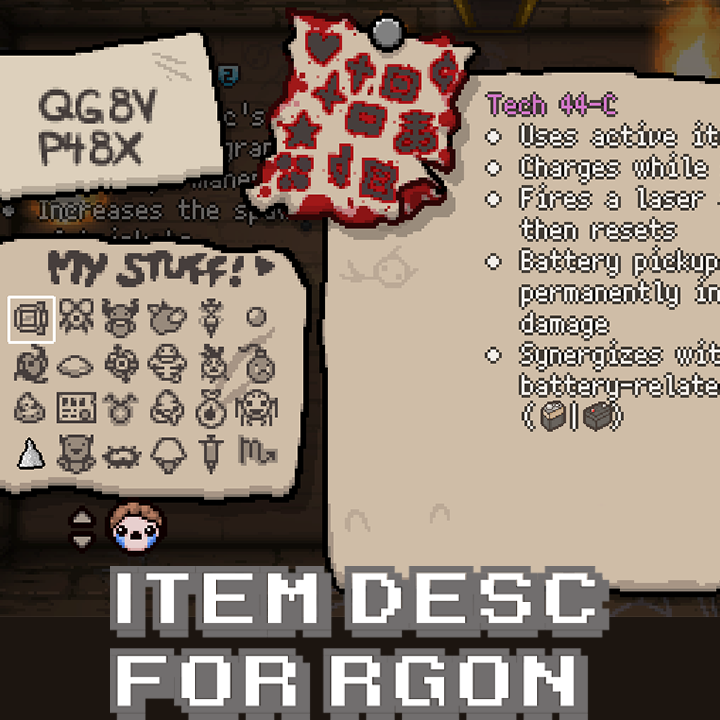

# Isaac Stuff Descriptions for REPENTOGON

<!-- markdownlint-disable-next-line MD033 -->

Adds item descriptions and item inspection controls to the **My Stuff** section of the pause menu in *The Binding of Isaac: Repentance+*.

The mod supports collectibles, smelted trinkets, modded collectibles, and modded trinkets. It also supports viewing items from multiple in-game characters, including local co-op players and multi-character setups.

The My Stuff display can automatically adapt to the layout of other custom pause-menu mods, allowing item icons and related UI elements to follow repositioned or resized My Stuff pages.

The mod is designed for the REPENTOGON-compatible game version and uses **External Item Descriptions (EID)** to provide item information.

## Dependencies

This mod requires:

- **REPENTOGON**
- **External Item Descriptions (EID)**

At the moment, REPENTOGON supports patch **v1.9.7.12** and automatically downgrades the game to that version when necessary.

Official Item Descriptions were introduced in **v1.9.7.13**, which is newer than the version currently supported by REPENTOGON. As a result, this mod is primarily intended for the REPENTOGON-compatible **v1.9.7.12** environment, where the official item-description feature is not available.

## Controls

While the pause menu is open:

- Press **Left** or **Right** to enter **Inspect Mode**.
- Use the **Up, Down, Left, and Right** directional controls to move the cursor between items.
- When the cursor reaches the topmost or bottommost item, pressing **Up** or **Down** again switches to another character's item list, if available.
- When the cursor reaches either horizontal edge of the item list, pressing **Left** or **Right** again in that direction exits Inspect Mode and returns control to the pause menu.

## Configuration

The mod provides additional options through Mod Config Menu.

### Appearance

- Adjust the brightness of item and trinket icons.
- Enable and customize icon outlines for better visibility against different pause-menu backgrounds.

### Layout

- Adjust the rendering offset of the My Stuff display.
